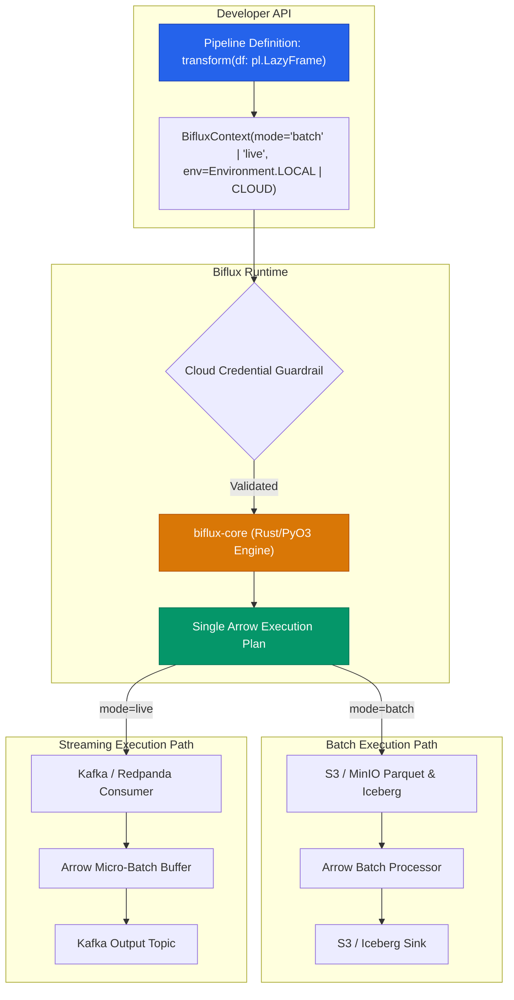

<div align="center">

# Biflux

**Unified Data Engineering Framework Eliminating Train-Serve Skew**

[](https://github.com/FranekJemiolo/biflux/actions/workflows/ci.yml)
[](https://franekjemiolo.github.io/biflux/)
[](LICENSE)
[](https://www.python.org/downloads/)
[](https://www.rust-lang.org/)

</div>

---

## ⚡ The Train-Serve Skew Problem

In production machine learning and quantitative systems, **Train-Serve Skew** is one of the most persistent sources of catastrophic failures:
- **Offline Backtests / Training**: Engineers write SQL, PySpark, DuckDB, or Polars scripts querying historical data lakes (S3, Apache Iceberg, Delta Lake).
- **Online Inference / Serving**: Systems engineers rewrite the feature pipeline in C++, Java (Flink), or Go consuming from real-time message buses (Apache Kafka, Redpanda).

Over time, discrepancies in timestamp truncation, floating-point rounding, window boundaries, null handling, or subtle mathematical logic creep into both codebases. Models fail silently in production because the real-time feature vector deviates from the historical training distribution.

## 🚀 The Biflux Solution

**Biflux** compiles data transformations authored once in a high-level Python API (using Polars) into a single, unified Rust/Apache Arrow execution plan. That identical plan is conditionally routed to:
1. **Batch Mode**: High-throughput distributed backtests and lakehouse ETL over S3 and Apache Iceberg.
2. **Live Mode**: Sub-millisecond real-time stream processing over Apache Kafka with zero-copy Arrow memory buffers.

Zero logic duplication. Zero mathematical divergence. Exact parity down to the decimal point.



---

## 📦 Installation

Install directly from GitHub via pip:

```bash
pip install "git+https://github.com/FranekJemiolo/biflux.git"
```

Or build locally from source (requires Rust toolchain):

```bash
git clone https://github.com/FranekJemiolo/biflux.git
cd biflux
pip install maturin
maturin develop
```

---

## 💡 Quickstart: One Pipeline, Two Worlds

Define your pipeline once:

```python
import polars as pl
from biflux.core import BifluxPipeline, BifluxContext, Environment

class VWAPModel(BifluxPipeline):
    def transform(self, df: pl.LazyFrame) -> pl.LazyFrame:
        # Single transformation graph used across both batch and live streams
        return (
            df.with_columns(
                mid_price=(pl.col("bid") + pl.col("ask")) / 2.0,
                dollar_volume=((pl.col("bid") + pl.col("ask")) / 2.0) * pl.col("size"),
            )
            .group_by("symbol")
            .agg(
                vwap=(pl.col("dollar_volume").sum() / pl.col("size").sum()),
                total_volume=pl.col("size").sum(),
            )
        )
```

### Side-by-Side Execution

=== "Batch Backtest (Historical Lakehouse)"
    ```python
    # 1. Historical Context: Reads historical Parquet/Iceberg tables from S3
    batch_ctx = BifluxContext(
        mode="batch",
        env=Environment.LOCAL,
        iceberg_catalog="rest://localhost:8181",
        s3_endpoint="http://localhost:9000",
    )

    pipeline = VWAPModel(batch_ctx)
    result = pipeline.run(
        source_uri="s3://market-data/raw_ticks/",
        sink_uri="s3://features/vwap_daily/",
    )
    print(f"Batch completed: {result.duration_ms}ms, status={result.status}")
    ```

=== "Live Stream (Real-Time Kafka)"
    ```python
    # 2. Live Context: Subscribes to real-time tick stream on Kafka
    live_ctx = BifluxContext(
        mode="live",
        env=Environment.LOCAL,
        kafka_brokers="localhost:9092",
    )

    pipeline = VWAPModel(live_ctx)
    result = pipeline.run(
        source_uri="market_ticks_topic",
        sink_uri="vwap_realtime_topic",
    )
    print(f"Streaming initialized: {result.duration_ms}ms, status={result.status}")
    ```

=== "Custom Python/Rust UDFs"
    ```python
    # 3. Accelerated User-Defined Functions with Rust Bindings
    from biflux import biflux_udf

    @biflux_udf
    def non_linear_risk(bid: float, ask: float) -> float:
        mid = (bid + ask) / 2.0
        return round(((ask - bid) / mid) * 10000.0, 4)

    # Use seamlessly inside pipeline.transform(df) across batch & live modes:
    # df.with_columns(risk=non_linear_risk(pl.col("bid"), pl.col("ask")))
    ```

---

## ⚡ Performance & Benchmarks

Biflux is engineered for sub-millisecond streaming and multi-million row/sec batch throughput:

| Benchmark | Scale / Batch Size | Latency / Execution Time | Throughput |
| :--- | :--- | :--- | :--- |
| **Historical Batch Engine** | 1,000,000 rows | **242 ms** | **4,129,685 rows/s** |
| **Live Streaming Micro-Batch** | 100 rows | **0.24 ms** (P50) | **408,510 rows/s** |
| **Live Streaming Micro-Batch** | 1,000 rows | **0.25 ms** (P50) | **4,022,801 rows/s** |
| **High-Throughput Streaming** | 50,000 rows | **0.56 ms** (P50) | **88,862,511 rows/s** |
| **Rust Zero-Copy Arrow IPC** | 100,000 records | **6.07 ms** | **668.4 MB/s (16.5M rec/s)** |

### 📊 Multi-Scale Framework Comparison (Biflux vs. Polars, DuckDB, Pandas)

#### Batch Backtest Throughput Across Scales
| Scale | Biflux (Unified) | Polars (Standalone) | DuckDB | Pandas |
| :--- | :--- | :--- | :--- | :--- |
| **100K rows** | **0.96 ms** (104.2M/s) | 0.91 ms (110.4M/s) | 1.35 ms (74.1M/s) | 2.52 ms (39.7M/s) |
| **500K rows** | **4.28 ms** (116.9M/s) | 4.11 ms (121.6M/s) | 5.01 ms (99.8M/s) | 7.76 ms (64.5M/s) |
| **1M rows** | **9.56 ms** (104.6M/s) | 8.90 ms (112.4M/s) | 9.81 ms (101.9M/s) | 14.70 ms (68.0M/s) |

#### Streaming Micro-Batch Latency (P50) Across Scales
| Micro-Batch Size | Biflux (Streaming) | Polars (Micro-Batch) | DuckDB (Micro-Batch) | Native Python | Pandas |
| :--- | :--- | :--- | :--- | :--- | :--- |
| **500 rows** | **0.18 ms** (2.7M/s) | 0.19 ms (2.6M/s) | 0.58 ms (0.86M/s) | 0.06 ms (9.1M/s) | 1.20 ms (0.42M/s) |
| **2,000 rows** | **0.26 ms** (7.6M/s) | 0.25 ms (8.0M/s) | 0.57 ms (3.5M/s) | 0.22 ms (9.1M/s) | 1.23 ms (1.6M/s) |
| **10,000 rows** | **0.30 ms** (33.5M/s) | 0.30 ms (33.1M/s) | 0.63 ms (15.8M/s) | 1.08 ms (9.3M/s) | 1.39 ms (7.2M/s) |
| **50,000 rows** | **0.62 ms** (80.6M/s) | 0.58 ms (85.7M/s) | 1.17 ms (42.8M/s) | 5.50 ms (9.1M/s) | 1.78 ms (28.1M/s) |

#### Batch vs. Streaming on Identical Sample Sizes
| Sample Size | Biflux (Batch) | Biflux (Streaming) | Polars (Standalone) | DuckDB | Pandas |
| :--- | :--- | :--- | :--- | :--- | :--- |
| **1,000 rows** | **0.22 ms** | **0.18 ms** | 0.16 ms | 0.45 ms | 1.14 ms |
| **10,000 rows** | **0.28 ms** | **0.29 ms** | 0.34 ms | 0.55 ms | 1.22 ms |
| **100,000 rows**| **0.88 ms** | **0.83 ms** | 0.79 ms | 1.30 ms | 2.36 ms |

### 🏆 Empirical Benchmark Across All Domain Pipeline Examples

Evaluated using `python benchmarks/benchmark_all_examples.py` across 50,000 batch rows and 1,000 streaming rows:

| Pipeline Example | Target Domain | Batch Throughput | Streaming Latency (P50) | Streaming Throughput | Max Train-Serve Skew |
| :--- | :--- | :--- | :--- | :--- | :--- |
| **Bond Pricing VWAP** | Fixed Income Analytics | **74.7M rows/s** (0.67 ms) | **0.26 ms** | **3.9M rows/s** | **0.000000% (Exact Parity)** |
| **Fraud Risk Scoring** | Payment Fraud Defense | **36.1M rows/s** (1.38 ms) | **0.41 ms** | **2.4M rows/s** | **0.000000% (Exact Parity)** |
| **L2 Orderbook Depth** | HFT Microstructure | **64.6M rows/s** (0.77 ms) | **0.30 ms** | **3.3M rows/s** | **0.000000% (Exact Parity)** |
| **IoT Predictive Health**| Industrial Turbines | **49.8M rows/s** (1.00 ms) | **0.38 ms** | **2.7M rows/s** | **0.000000% (Exact Parity)** |
| **Option Risk (Rust UDF)**| Options Pricing & Greeks | **698.9K rows/s** (71.5 ms)| **1.71 ms** | **585.2K rows/s** | **0.000000% (Exact Parity)** |

*Explore full empirical details in the [Performance & Latency Benchmarks](https://franekjemiolo.github.io/biflux/benchmarks/) and [Comparative Analysis](https://franekjemiolo.github.io/biflux/comparative_analysis/) docs.*

---

## 📁 Real-World Domain Examples

The [`examples/`](examples/) directory contains production-ready pipelines proving exact Train-Serve parity:

| Example Pipeline | Source File | Description |
| :--- | :--- | :--- |
| **Kafka & S3 Bridge** | [`kafka_s3_bridge_pipeline.py`](examples/kafka_s3_bridge_pipeline.py) | Dual-sink ingestion from Kafka to real-time topic & S3 Parquet with zero-skew replay. |
| **Bond Pricing VWAP** | [`bond_pricing_pipeline.py`](examples/bond_pricing_pipeline.py) | Corporate bond VWAP backtest vs. Kafka live stream with zero-skew proof. |
| **Payment Fraud Detection** | [`fraud_detection_pipeline.py`](examples/fraud_detection_pipeline.py) | Cardholder velocity, spending z-scores, and real-time fraud alert triggers. |
| **L2 Orderbook Depth** | [`orderbook_depth_pipeline.py`](examples/orderbook_depth_pipeline.py) | High-frequency orderbook imbalance ratio, micro-price, and spread in bps. |
| **IoT Predictive Maintenance**| [`iot_sensor_telemetry_pipeline.py`](examples/iot_sensor_telemetry_pipeline.py) | Vibration energy RMS, thermal stress gradients, and turbine health indices. |
| **Custom Python/Rust UDF**| [`custom_udf_pipeline.py`](examples/custom_udf_pipeline.py) | Black-Scholes delta and non-linear risk UDFs evaluated via Rust bindings. |
| **Airflow Orchestration** | [`airflow_dag.py`](examples/airflow_dag.py) | Scheduled batch feature extraction in production Apache Airflow DAGs. |

---

## 🐳 Local Kafka & S3 Cluster Testing (Docker Compose)

Biflux includes full integration tests that run against a real local Kafka cluster orchestrated with Docker Compose:

```bash
# 1. Launch local Kafka cluster
docker compose up -d

# 2. Run integration tests validating real Kafka broker & S3 Parquet parity
pytest integration_tests/test_docker_kafka_cluster.py -v

# Or execute the automated end-to-end runner (boots cluster, runs tests, cleans up)
./scripts/run_docker_compose_tests.sh
```

---

## 🛡️ Enterprise Guardrails

Biflux includes built-in safety mechanisms:
- **Cloud vs. Local Parity**: Prevents accidental AWS/GCP access during local unit testing.
- **Strict Credential Validation**: When `env=Environment.CLOUD`, credentials must be explicitly confirmed or present, otherwise `BifluxCredentialError` is raised.
- **Airflow & Orchestration Ready**: First-class support for Airflow DAGs and Prefect tasks.

---

## 📖 Documentation

Comprehensive guides, tutorials, and architectural deep-dives are available on our [Documentation Site](https://franekjemiolo.github.io/biflux/):
- [Architecture & Zero-Copy Memory Model](https://franekjemiolo.github.io/biflux/architecture/)
- [Kafka & S3 Lakehouse Integration](https://franekjemiolo.github.io/biflux/kafka_s3_integration/)
- [Custom Python UDFs with Rust Acceleration](https://franekjemiolo.github.io/biflux/udf/)
- [Performance & Latency Benchmarks](https://franekjemiolo.github.io/biflux/benchmarks/)
- [Cross-Framework Comparative Analysis](https://franekjemiolo.github.io/biflux/comparative_analysis/)
- [E2E Bond Pricing VWAP Tutorial](https://franekjemiolo.github.io/biflux/tutorials/)
- [Apache Airflow Orchestration Guide](https://franekjemiolo.github.io/biflux/tutorials/#airflow)

---

## 📜 License

Project Biflux is licensed under the Apache 2.0 License. See [LICENSE](LICENSE) for details.
