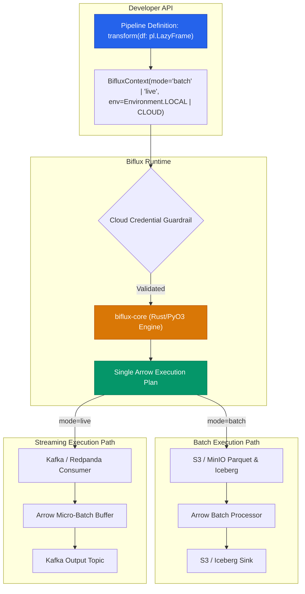

<div align="center">

# Biflux

**Unified Data Engineering Framework Eliminating Train-Serve Skew**

[](https://github.com/FranekJemiolo/biflux/actions/workflows/ci.yml)
[](https://franekjemiolo.github.io/biflux/)
[](LICENSE)
[](https://www.python.org/downloads/)
[](https://www.rust-lang.org/)

</div>

---

## ⚡ The Train-Serve Skew Problem

In production machine learning and quantitative systems, **Train-Serve Skew** is one of the most persistent sources of catastrophic failures:
- **Offline Backtests / Training**: Engineers write SQL, PySpark, DuckDB, or Polars scripts querying historical data lakes (S3, Apache Iceberg, Delta Lake).
- **Online Inference / Serving**: Systems engineers rewrite the feature pipeline in C++, Java (Flink), or Go consuming from real-time message buses (Apache Kafka, Redpanda).

Over time, discrepancies in timestamp truncation, floating-point rounding, window boundaries, null handling, or subtle mathematical logic creep into both codebases. Models fail silently in production because the real-time feature vector deviates from the historical training distribution.

## 🚀 The Biflux Solution

**Biflux** compiles data transformations authored once in a high-level Python API (using Polars) into a single, unified Rust/Apache Arrow execution plan. That identical plan is conditionally routed to:
1. **Batch Mode**: High-throughput distributed backtests and lakehouse ETL over S3 and Apache Iceberg.
2. **Live Mode**: Sub-millisecond real-time stream processing over Apache Kafka with zero-copy Arrow memory buffers.

Zero logic duplication. Zero mathematical divergence. Exact parity down to the decimal point.



---

## 📦 Installation

Install the pre-compiled wheel via pip:

```bash
pip install biflux
```

Or build locally from source (requires Rust toolchain):

```bash
git clone https://github.com/FranekJemiolo/biflux.git
cd biflux
pip install maturin
maturin develop
```

---

## 💡 Quickstart: One Pipeline, Two Worlds

Define your pipeline once:

```python
import polars as pl
from biflux.core import BifluxPipeline, BifluxContext, Environment

class VWAPModel(BifluxPipeline):
    def transform(self, df: pl.LazyFrame) -> pl.LazyFrame:
        # Single transformation graph used across both batch and live streams
        return (
            df.with_columns(
                mid_price=(pl.col("bid") + pl.col("ask")) / 2.0,
                dollar_volume=((pl.col("bid") + pl.col("ask")) / 2.0) * pl.col("size"),
            )
            .group_by("symbol")
            .agg(
                vwap=(pl.col("dollar_volume").sum() / pl.col("size").sum()),
                total_volume=pl.col("size").sum(),
            )
        )
```

### Side-by-Side Execution

=== "Batch Backtest (Historical Lakehouse)"
    ```python
    # 1. Historical Context: Reads historical Parquet/Iceberg tables from S3
    batch_ctx = BifluxContext(
        mode="batch",
        env=Environment.LOCAL,
        iceberg_catalog="rest://localhost:8181",
        s3_endpoint="http://localhost:9000",
    )

    pipeline = VWAPModel(batch_ctx)
    result = pipeline.run(
        source_uri="s3://market-data/raw_ticks/",
        sink_uri="s3://features/vwap_daily/",
    )
    print(f"Batch completed: {result.duration_ms}ms, status={result.status}")
    ```

=== "Live Stream (Real-Time Kafka)"
    ```python
    # 2. Live Context: Subscribes to real-time tick stream on Kafka
    live_ctx = BifluxContext(
        mode="live",
        env=Environment.LOCAL,
        kafka_brokers="localhost:9092",
    )

    pipeline = VWAPModel(live_ctx)
    result = pipeline.run(
        source_uri="market_ticks_topic",
        sink_uri="vwap_realtime_topic",
    )
    print(f"Streaming initialized: {result.duration_ms}ms, status={result.status}")
    ```

---

## ⚡ Performance & Benchmarks

Biflux is engineered for sub-millisecond streaming and multi-million row/sec batch throughput:

| Benchmark | Scale / Batch Size | Latency / Execution Time | Throughput |
| :--- | :--- | :--- | :--- |
| **Historical Batch Engine** | 1,000,000 rows | **242 ms** | **4,129,685 rows/s** |
| **Live Streaming Micro-Batch** | 100 rows | **0.24 ms** (P50) | **408,510 rows/s** |
| **Live Streaming Micro-Batch** | 1,000 rows | **0.25 ms** (P50) | **4,022,801 rows/s** |
| **High-Throughput Streaming** | 50,000 rows | **0.56 ms** (P50) | **88,862,511 rows/s** |
| **Rust Zero-Copy Arrow IPC** | 100,000 records | **6.07 ms** | **668.4 MB/s (16.5M rec/s)** |

### 📊 Cross-Framework Comparison (Biflux vs. Polars, DuckDB, Pandas)

| Framework | Batch 1M Records | Streaming 5K Records (P50) | Codebase Parity / Skew Risk |
| :--- | :--- | :--- | :--- |
| **Biflux (Unified Engine)** | **9.6 ms** (104.3M rows/s) | **0.27 ms** (18.3M rows/s) | **0.000% Skew (100% Unified Pipeline)** |
| **Polars (Standalone)** | 8.8 ms (114.3M rows/s) | 0.27 ms (18.2M rows/s) | High Skew Risk (No streaming abstraction; manual Kafka glue) |
| **DuckDB** | 9.9 ms (101.2M rows/s) | N/A (In-memory SQL only) | Separate SQL vs streaming codebases |
| **Pandas** | 15.6 ms (64.2M rows/s) | 1.43 ms (3.5M rows/s) | Critical Skew Risk & heavy GC pauses |

*Run comparative benchmarks with `python benchmarks/comparative_benchmark.py`. Read the in-depth [Comparative Analysis](https://franekjemiolo.github.io/biflux/comparative_analysis/).*

---

## 📁 Real-World Domain Examples

The [`examples/`](examples/) directory contains production-ready pipelines proving exact Train-Serve parity:

| Example Pipeline | Source File | Description |
| :--- | :--- | :--- |
| **Bond Pricing VWAP** | [`bond_pricing_pipeline.py`](examples/bond_pricing_pipeline.py) | Corporate bond VWAP backtest vs. Kafka live stream with zero-skew proof. |
| **Payment Fraud Detection** | [`fraud_detection_pipeline.py`](examples/fraud_detection_pipeline.py) | Cardholder velocity, spending z-scores, and real-time fraud alert triggers. |
| **L2 Orderbook Depth** | [`orderbook_depth_pipeline.py`](examples/orderbook_depth_pipeline.py) | High-frequency orderbook imbalance ratio, micro-price, and spread in bps. |
| **IoT Predictive Maintenance**| [`iot_sensor_telemetry_pipeline.py`](examples/iot_sensor_telemetry_pipeline.py) | Vibration energy RMS, thermal stress gradients, and turbine health indices. |
| **Airflow Orchestration** | [`airflow_dag.py`](examples/airflow_dag.py) | Scheduled batch feature extraction in production Apache Airflow DAGs. |

---

## 🛡️ Enterprise Guardrails

Biflux includes built-in safety mechanisms:
- **Cloud vs. Local Parity**: Prevents accidental AWS/GCP access during local unit testing.
- **Strict Credential Validation**: When `env=Environment.CLOUD`, credentials must be explicitly confirmed or present, otherwise `BifluxCredentialError` is raised.
- **Airflow & Orchestration Ready**: First-class support for Airflow DAGs and Prefect tasks.

---

## 📖 Documentation

Comprehensive guides, tutorials, and architectural deep-dives are available on our [Documentation Site](https://franekjemiolo.github.io/biflux/):
- [Architecture & Zero-Copy Memory Model](https://franekjemiolo.github.io/biflux/architecture/)
- [Performance & Latency Benchmarks](https://franekjemiolo.github.io/biflux/benchmarks/)
- [E2E Bond Pricing VWAP Tutorial](https://franekjemiolo.github.io/biflux/tutorials/)
- [Apache Airflow Orchestration Guide](https://franekjemiolo.github.io/biflux/tutorials/#airflow)

---

## 📜 License

Project Biflux is licensed under the Apache 2.0 License. See [LICENSE](LICENSE) for details.
