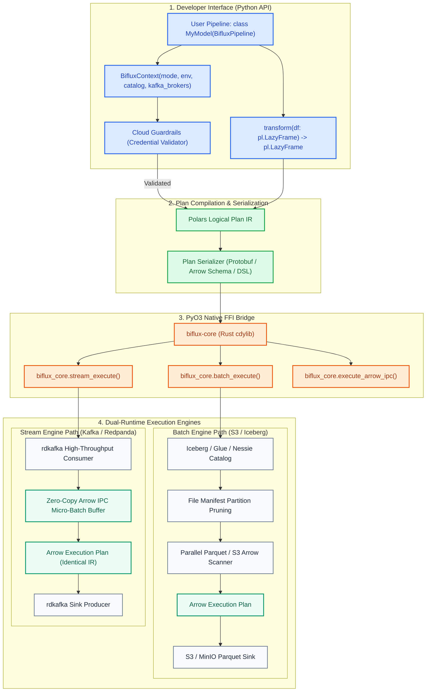
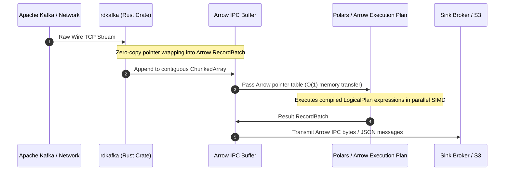
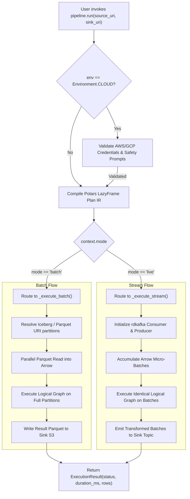

# Biflux System Architecture & Technical Design

Project Biflux is engineered as a unified, dual-runtime execution engine that bridges offline analytical lakehouses with real-time streaming buses through a single Apache Arrow compilation graph.

---

## 🏛️ System Overview & Component Topology



---

## ⚡ Zero-Copy Arrow Memory Model

In conventional architectures, real-time message streams undergo severe serialization penalties:

```
[Kafka TCP Stream]
       │
       ▼ (Wire deserialization)
[JSON / Avro Strings]
       │
       ▼ (Python heap allocation)
[Python Dicts & Objects]
       │
       ▼ (DataFrame creation & copy)
[Pandas / Arrow Table]
       │
       ▼ (Feature computation)
[Output DataFrame]
       │
       ▼ (JSON serialization)
[Kafka Producer Socket]
```

### The Biflux In-Memory Pathway

Biflux eliminates intermediate string and dictionary allocations by operating directly on **pre-allocated Apache Arrow `RecordBatch` buffers**:



### Memory Safety & Rust Invariants

1. **Foreign Function Interface (PyO3)**: Memory blocks allocated in Rust are tracked by `Arc<arrow::array::RecordBatch>`. Python accesses the memory through Arrow PyCapsule / IPC streams without duplicating underlying memory arrays.
2. **SIMD Vectorization**: Numerical computations (`mid = (bid + ask) / 2.0`, `vwap = sum(dollar_vol) / sum(vol)`) compile directly to AVX-512 / ARM Neon vector instructions.
3. **Partition Pruning**: In batch mode, Iceberg manifest files are scanned in Rust to eliminate non-matching partitions before reading Parquet byte ranges from S3.

---

## 🔀 Batch vs. Stream Execution Routing



---

## 🛡️ Cloud Guardrail Architecture

To protect engineering organizations against catastrophic AWS/GCP cost overruns during local testing or CI runs, Biflux implements a two-tier gate:

1. **Environment Separation**: `Environment.LOCAL` (default) explicitly targets `localhost` MinIO and Redpanda endpoints, bypassing cloud credential checks.
2. **Cloud Gating**: `Environment.CLOUD` strictly checks for active credentials (`AWS_ACCESS_KEY_ID`, `AWS_SECRET_ACCESS_KEY`, or `GOOGLE_APPLICATION_CREDENTIALS`). If missing in an interactive session, it prompts the developer with explicit cost warnings; in automated non-interactive runs, it halts immediately with `BifluxCredentialError`.
