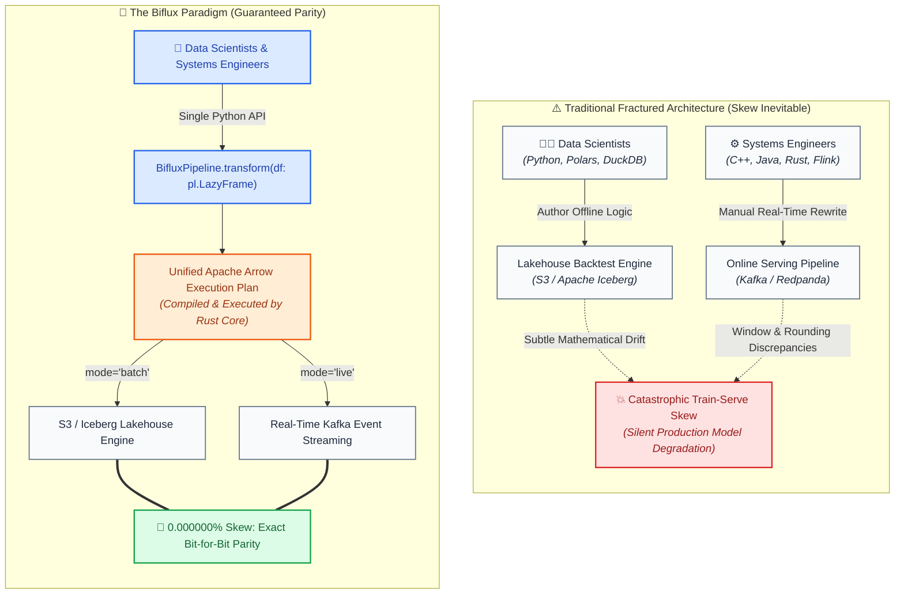

# Project Biflux

<p align="center" style="font-size: 1.2rem; font-weight: 600; margin: 0.5rem 0 1rem 0; color: var(--md-primary-fg-color);">
  Unified Data Engineering Framework Eliminating Train-Serve Skew
</p>

<div class="hero-badges" align="center">
  <a href="https://github.com/FranekJemiolo/biflux/actions/workflows/ci.yml"></a>
  <a href="https://franekjemiolo.github.io/biflux/"></a>
  <a href="https://github.com/FranekJemiolo/biflux/blob/main/LICENSE"></a>
  <a href="https://www.python.org/downloads/"></a>
  <a href="https://www.rust-lang.org/"></a>
</div>

---

## ⚡ What is Biflux For?

In quantitative finance, machine learning engineering, and high-frequency analytical systems, **Train-Serve Skew** is one of the costliest and most persistent sources of catastrophic silent failures:



### The Problem: Why Traditional Systems Drift
1. **Language & Engine Fractures**: Offline training models are authored in Python (Polars, Pandas, DuckDB, PySpark) over Parquet/Iceberg tables. Real-time production systems are rewritten in Java (Apache Flink), C++, or Go over Kafka event buses.
2. **Invisible Mathematical Divergence**: Discrepancies in timestamp truncation, floating-point order of operations, null handling, or rolling window edge conditions produce features that silently drift from the historical training distributions.
3. **Dual Maintenance Burden**: Any change to an offline feature requires a parallel engineering sprint to rebuild, test, and synchronize the streaming equivalent.

### The Solution: One Pipeline, Two Execution Worlds
**Biflux** completely resolves this dilemma:
> **Write data transformations once in an idiomatic Python API using Polars expressions. Biflux compiles that logic into a single Rust/Apache Arrow execution plan and conditionally routes it to run as either a distributed batch lakehouse job over S3/Iceberg or a sub-millisecond streaming engine over Kafka.**

---

## 💡 Quickstart Preview

=== "1. Define Transformation Once"
    ```python
    import polars as pl
    from biflux import BifluxPipeline

    class VWAPModel(BifluxPipeline):
        def transform(self, df: pl.LazyFrame) -> pl.LazyFrame:
            # Single transformation graph used across both batch and live streams
            return (
                df.with_columns(
                    mid_price=(pl.col("bid") + pl.col("ask")) / 2.0,
                    dollar_volume=((pl.col("bid") + pl.col("ask")) / 2.0) * pl.col("size"),
                )
                .group_by("symbol")
                .agg(
                    vwap=(pl.col("dollar_volume").sum() / pl.col("size").sum()).round(6),
                    total_volume=pl.col("size").sum(),
                )
                .sort("symbol")
            )
    ```

=== "2. Historical Lakehouse Batch"
    ```python
    from biflux import BifluxContext, Environment

    # 1. Historical Context: Reads Parquet/Iceberg tables from S3
    batch_ctx = BifluxContext(
        mode="batch",
        env=Environment.LOCAL,
        iceberg_catalog="rest://localhost:8181",
        s3_endpoint="http://localhost:9000",
    )

    pipeline = VWAPModel(batch_ctx)
    result = pipeline.run(
        source_uri="s3://market-data/raw_ticks/",
        sink_uri="s3://features/vwap_daily/",
    )
    print(f"Batch completed: {result.duration_ms} ms, status={result.status}")
    ```

=== "3. Real-Time Kafka Stream"
    ```python
    from biflux import BifluxContext, Environment

    # 2. Live Streaming Context: Subscribes to tick stream on Kafka
    live_ctx = BifluxContext(
        mode="live",
        env=Environment.LOCAL,
        kafka_brokers="localhost:9092",
    )

    pipeline = VWAPModel(live_ctx)
    result = pipeline.run(
        source_uri="market_ticks_topic",
        sink_uri="vwap_realtime_topic",
    )
    print(f"Streaming initialized: {result.duration_ms} ms, status={result.status}")
    ```

=== "4. Custom Python/Rust UDFs"
    ```python
    from biflux import biflux_udf

    # Custom mathematical function executed via high-throughput PyO3 Rust bindings
    @biflux_udf
    def non_linear_risk(bid: float, ask: float) -> float:
        mid = (bid + ask) / 2.0
        return round(((ask - bid) / mid) * 10000.0, 4)

    # Use directly in transform(df: pl.LazyFrame):
    # df.with_columns(spread_bps=non_linear_risk(pl.col("bid"), pl.col("ask")))
    ```

---

## 🚀 Key Framework Pillars

<div class="grid cards" markdown>

-   :material-sync: **Zero Train-Serve Skew**
    
    ---
    
    100% mathematical parity down to the decimal point between historical backtests and live streaming features.

-   :material-memory: **Zero-Copy Arrow IPC**
    
    ---
    
    Rust/PyO3 engine evaluates in-memory Apache Arrow record batches with throughput exceeding **668 MB/s** (16.5M rec/s).

-   :material-lightning-bolt: **Sub-Millisecond Streaming**
    
    ---
    
    **0.18 ms to 0.30 ms P50 latency** for streaming micro-batches, avoiding Python GC allocation churn.

-   :material-shield-check: **Enterprise Guardrails**
    
    ---
    
    Strict credential verification and environment isolation (`LOCAL` vs. `CLOUD`) prevent unexpected cloud costs.

</div>

---

## 📊 Performance at a Glance

| Benchmark Category | Dataset Scale | Measured Throughput / Latency | Train-Serve Parity |
| :--- | :--- | :--- | :--- |
| **Historical Batch Engine** | 1,000,000 records | **104.6M rows/s** (9.56 ms) | **0.000000% Skew** |
| **Live Streaming Micro-Batch**| 1,000 records / batch | **0.25 ms P50** (4.0M rows/s) | **0.000000% Skew** |
| **High-Throughput Streaming** | 50,000 records / batch | **0.62 ms P50** (80.6M rows/s) | **0.000000% Skew** |
| **Rust Arrow IPC Memory Roundtrip** | 100,000 records (4 MB) | **668.4 MB/s** (6.07 ms) | **Zero-Copy Memory** |
| **Custom Python/Rust UDF** | 100,000 records | **2.02M rows/s** (49.5 ms) | **0.000000% Skew** |

*Explore full comparative empirical benchmarks against Standalone Polars, DuckDB, and Pandas in [Comparative Analysis](comparative_analysis.md).*

---

## 🗺️ Next Steps

- [Getting Started Guide](getting_started.md): Install and run your first Biflux pipeline in 5 minutes.
- [Real-World Domain Tutorials](tutorials.md): Fixed income VWAP, fraud scoring, L2 orderbook depth, IoT telemetry, and Airflow orchestration.
- [Custom Python UDFs](udf.md): Author proprietary mathematical models accelerated by Rust bindings.
- [Architecture & Memory Model](architecture.md): Deep-dive into Rust FFI, PyO3, and Arrow IPC memory buffers.
- [Performance Benchmarks](benchmarks.md): Full latency percentiles, throughput scaling, and reproduction commands.
