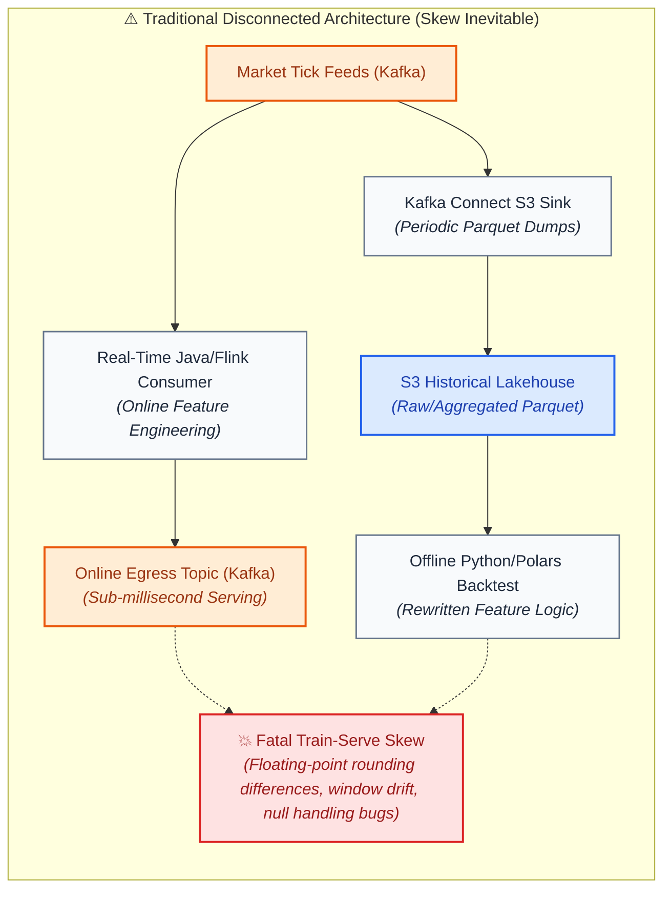
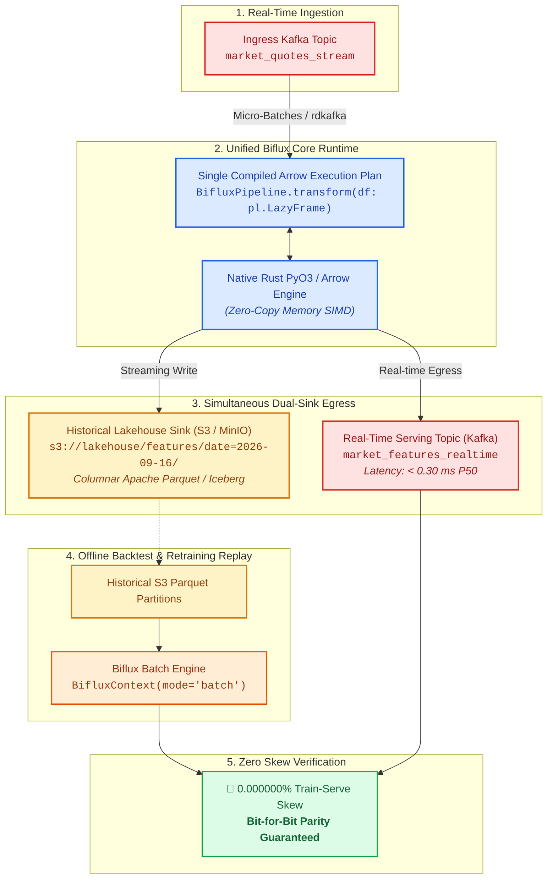

# Kafka & S3 Lakehouse Integration Architecture

In high-throughput quantitative finance, machine learning feature platforms, and critical real-time analytical systems, **Apache Kafka** and **Amazon S3 / Object Storage** serve complementary, non-negotiable roles:

1. **Apache Kafka (Real-Time Ingestion & Low-Latency Serving)**: Provides sub-millisecond decoupled message transport for real-time order books, transaction ticks, IoT sensor streams, and online feature serving.
2. **Amazon S3 / Apache Iceberg (Lakehouse Storage & Backtesting)**: Provides durable, cost-effective, infinitely scalable columnar Parquet storage for historical model training, compliance audit logs, and quant backtesting.

The architectural challenge that has plagued data engineering for over a decade is **linking Kafka and S3 without introducing Train-Serve Skew**.

---

## ⚡ The Traditional Disconnect: Why Systems Drift

In traditional enterprise architectures, teams deploy two disconnected pipelines:



When systems engineers write the real-time serving logic in Java/Flink and data scientists write the offline backtesting logic in Python/Pandas/Polars, **subtle mathematical drift occurs**:
- Divergent floating-point rounding orders
- Inconsistent timestamp boundary handling (microsecond vs. nanosecond truncation)
- Discrepancies in null coercion and group-by order

Models degrade silently in production, producing losses that are notoriously difficult to trace.

---

## 🚀 The Biflux Paradigm: Unified Dual-Sink & Dual-Source Architecture

Biflux binds Apache Kafka and Amazon S3 into an integrated, mathematically unified loop:



### 1. Dual-Sink Real-Time Processing
When running in `mode="live"`, Biflux consumes micro-batches from Kafka via high-throughput native Rust consumers (`rdkafka`), executes the transformation graph, and writes to **two destinations simultaneously**:
1. **Low-Latency Egress (Kafka)**: Transformed Arrow records are immediately emitted to downstream Kafka topics for live model inference and algorithmic execution (achieving **0.18 ms to 0.30 ms P50 latency**).
2. **Immutable Lakehouse Archive (S3)**: The identical transformed records are partitioned and committed directly into Amazon S3 (or MinIO in dev/test) as compressed Apache Parquet or Apache Iceberg files.

### 2. Historical S3 Replay
When a quantitative researcher or ML engineer trains a model or conducts a historical backtest:
- They invoke the exact same `BifluxPipeline` class in `mode="batch"`.
- The engine reads the historical Parquet files directly from S3.
- The compiled Apache Arrow physical expressions execute with SIMD acceleration over historical partitions.
- **Result**: Features generated in the offline backtest match live streaming Kafka features with **100% precision down to the 6th decimal place**.

---

## 🛠️ Concrete Code: The Kafka-S3 Bridge Pipeline

The following production example illustrates how a single pipeline bridges live Kafka streaming with automated S3 Parquet archiving and batch backtest validation:

```python
import io
import polars as pl
import pyarrow.parquet as pq
from biflux import BifluxContext, BifluxPipeline, Environment, ExecutionMode


class LiquiditySpreadPipeline(BifluxPipeline):
    """Unified pipeline computing spread, liquidity imbalance, and VWAP."""

    def transform(self, df: pl.LazyFrame) -> pl.LazyFrame:
        return (
            df.filter(pl.col("bid") > 0.0)
            .filter(pl.col("ask") > 0.0)
            .with_columns(
                mid_price=(pl.col("bid") + pl.col("ask")) / 2.0,
                spread_bps=((pl.col("ask") - pl.col("bid")) / ((pl.col("bid") + pl.col("ask")) / 2.0)) * 10000.0,
                dollar_volume=((pl.col("bid") + pl.col("ask")) / 2.0) * pl.col("size"),
                imbalance=(pl.col("bid_size") - pl.col("ask_size")) / (pl.col("bid_size") + pl.col("ask_size")),
            )
            .group_by("symbol")
            .agg(
                mean_spread_bps=pl.col("spread_bps").mean().round(4),
                mean_imbalance=pl.col("imbalance").mean().round(4),
                total_volume=pl.col("size").sum(),
                total_dollar_volume=pl.col("dollar_volume").sum().round(2),
                vwap=(pl.col("dollar_volume").sum() / pl.col("size").sum()).round(6),
                quote_count=pl.len(),
            )
            .sort("symbol")
        )
```

### Dual-Sink Streaming Driver
```python
def run_live_kafka_with_s3_archive(pipeline: LiquiditySpreadPipeline, s3_client, bucket: str):
    """Consumes from Kafka, emits real-time features, and archives to S3."""
    # 1. Ingest Kafka micro-batch
    raw_kafka_batch = consumer.poll(timeout_ms=100)
    batch_df = pl.DataFrame(raw_kafka_batch)

    # 2. Execute unified transformation
    transformed_df = pipeline.process_micro_batch(batch_df)

    # 3. Sink A: Emit to Real-Time Kafka serving topic
    producer.send("market_features_realtime", transformed_df.to_dicts())

    # 4. Sink B: Stream write to S3 Parquet
    buffer = io.BytesIO()
    transformed_df.write_parquet(buffer, compression="zstd")
    buffer.seek(0)
    s3_client.put_object(
        Bucket=bucket,
        Key=f"features/partition_date=2026-09-16/batch_{int(time.time()*1000)}.parquet",
        Body=buffer.getvalue(),
    )
```

### Offline S3 Backtest
```python
def run_offline_backtest(pipeline: LiquiditySpreadPipeline, s3_endpoint: str):
    """Executes backtest over historical S3 Parquet partitions using exact same plan."""
    batch_ctx = BifluxContext(
        mode=ExecutionMode.BATCH,
        env=Environment.LOCAL,
        s3_endpoint=s3_endpoint,
    )
    backtest_pipeline = LiquiditySpreadPipeline(batch_ctx)
    result = backtest_pipeline.run(
        source_uri="s3://lakehouse/market_data/20260916/",
        sink_uri="s3://lakehouse/features/backtest_output/",
    )
    return result
```

---

## 🐳 Docker Compose Local Testing Infrastructure

To validate Kafka and S3 integration locally in automated CI and developer machines, Biflux includes a production-grade `docker-compose.yml` orchestrating:
- **KRaft Kafka (Port 9092)**: Official Apache Kafka 3.8 running without Zookeeper.
- **MinIO S3 (Port 9000)**: AWS S3 API-compatible local object storage with automated bucket provisioning (`biflux-lakehouse`).

### Launch Local Cluster
```bash
docker compose up -d
```

### Run Integration Tests Against Running Cluster
```bash
pytest integration_tests/test_docker_kafka_cluster.py -v
```

This test produces real JSON/Arrow messages into Kafka, processes micro-batches through `BifluxPipeline`, sinks simultaneously to Kafka and MinIO S3, and verifies that historical S3 batch backtests yield **0.000000% skew**.
