# Custom Python UDFs with Rust Acceleration

While Polars offers a rich expression engine, quantitative finance and production machine learning pipelines often require proprietary, non-linear, or domain-specific mathematical functions:
- Black-Scholes theoretical option pricing and implied volatility calculations.
- Proprietary microstructure spread dampeners and Kalman filter state updates.
- Non-linear fraud scoring functions and multi-factor risk models.

**Project Biflux** allows developers to author custom Python user-defined functions (UDFs) that are executed at native speeds via **Rust/PyO3 bindings** across both historical batch backtests and real-time Kafka streams.

---

## ⚡ Key Features

1. **Native Python Syntax**: Write standard Python functions using standard math or scientific libraries.
2. **Rust-Accelerated Execution**: Numeric arrays and Apache Arrow memory buffers are evaluated directly in Rust, avoiding Python object instantiation loops.
3. **Dual-Runtime Execution**: The exact same UDF executes in both **Batch Mode** (over S3/Parquet/Iceberg tables) and **Live Streaming Mode** (over Kafka micro-batches).
4. **Guaranteed Zero Skew**: Exact bit-for-bit float computation ensures **0.000000% Train-Serve Skew**.
5. **Zero-Copy Arrow IPC Support**: Direct evaluation on in-memory Arrow IPC buffers via `apply_udf_on_arrow_ipc`.

---

## ⚡ Zero-Copy Execution Architecture

```mermaid
flowchart LR
    Py["Python Pipeline<br/><b>@biflux_udf</b>"] -->|Pass Arrow Stream / Table| IPC["In-Memory Arrow IPC Buffer<br/><i>(C-Data Interface / Shared Memory)</i>"]
    IPC -->|Zero-Copy Pointer Handoff| Rust["Rust PyO3 Engine<br/><b>biflux-core::udf</b>"]
    Rust -->|SIMD Vectorized Math| SIMD["Native CPU Vector Math<br/><i>(Zero Object Allocation)</i>"]
    SIMD -->|Write Results| Out["Output Arrow RecordBatch"]
    Out -->|Zero-Copy Return| Result["Python LazyFrame / Stream Result"]

    classDef py fill:#dbeafe,stroke:#2563eb,stroke-width:2px,color:#1e40af;
    classDef rust fill:#ffedd5,stroke:#ea580c,stroke-width:2px,color:#9a3412;
    classDef arrow fill:#ecfdf5,stroke:#059669,stroke-width:2px,color:#065f46;

    class Py,Result py;
    class Rust,SIMD rust;
    class IPC,Out arrow;
```



---

## 🛠️ API & Usage Guide

### 1. Declaring a Custom UDF with `@biflux_udf`

Use the `@biflux_udf` decorator to declare a Python function as an accelerated Biflux UDF:

```python
import math
from biflux import biflux_udf

@biflux_udf
def non_linear_risk_score(bid: float, ask: float) -> float:
    """Computes non-linear spread penalty evaluated via Rust bindings."""
    mid = (bid + ask) / 2.0
    spread = ask - bid
    if mid <= 0:
        return 0.0
    rel_spread = spread / mid
    return round(math.log(1.0 + rel_spread * 1000.0) * math.sqrt(mid), 6)
```

### 2. Composing UDFs inside `BifluxPipeline.transform`

Inside your `transform` method, pass columns directly into your `@biflux_udf` function:

```python
import polars as pl
from biflux import BifluxPipeline

class OptionRiskPipeline(BifluxPipeline):
    def transform(self, df: pl.LazyFrame) -> pl.LazyFrame:
        return (
            df.with_columns(
                risk_score=non_linear_risk_score(pl.col("bid"), pl.col("ask")),
            )
            .group_by("symbol")
            .agg(
                mean_risk=pl.col("risk_score").mean().round(6),
                max_risk=pl.col("risk_score").max().round(6),
            )
        )
```

### 3. Direct Arrow IPC Micro-Batch Evaluation

For real-time streaming engines consuming raw Arrow IPC bytes:

```python
from biflux import apply_udf

# Execute custom Python UDF directly on in-memory Arrow IPC bytes in Rust
output_ipc_bytes = apply_udf(
    input_ipc_bytes,
    non_linear_risk_score,
    input_cols=["bid", "ask"],
    output_col="risk_score",
)
```

---

## 🔬 Performance & Latency Benchmarks

Evaluated with `python benchmarks/benchmark_udf.py`:

### Batch Mode UDF Throughput
| Dataset Scale | Execution Time (ms) | Throughput (rows/s) |
| :--- | :--- | :--- |
| **10,000 records** | **5.29 ms** | **1,890,166 rows/s** |
| **100,000 records** | **49.58 ms** | **2,016,836 rows/s** |
| **500,000 records** | **251.33 ms** | **1,989,432 rows/s** |

### Streaming Micro-Batch UDF Latency (P50)
| Micro-Batch Size | P50 Latency (ms) | Streaming Throughput (rows/s) |
| :--- | :--- | :--- |
| **500 records** | **0.54 ms** | **934,071 rows/s** |
| **2,000 records** | **1.49 ms** | **1,342,057 rows/s** |
| **10,000 records** | **5.43 ms** | **1,842,610 rows/s** |

### Direct Rust PyO3 Evaluation
- **Vector Latency**: **46.84 ms** for 100,000 records.
- **Vector Throughput**: **2,134,967 rows/s**.

---

## 📁 Example Implementation

See [`examples/custom_udf_pipeline.py`](https://github.com/FranekJemiolo/biflux/blob/main/examples/custom_udf_pipeline.py) for the complete end-to-end options risk model asserting 0.000000% Train-Serve Skew across 20,000 quotes.
