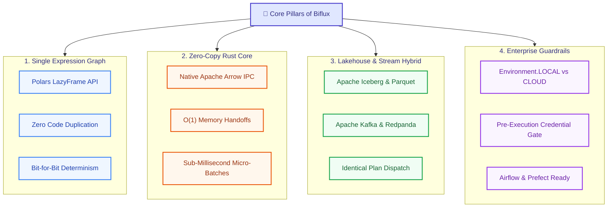
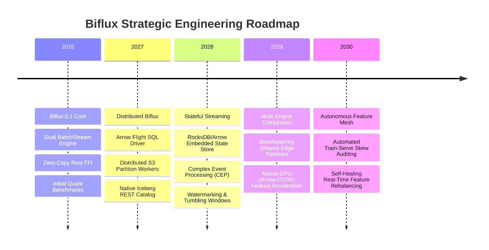

# Project Biflux: Vision & Design Document

> **The Unified Data Engineering Framework for Eliminating Train-Serve Skew**

---

## 🎯 Executive Summary & Thesis

In quantitative finance, algorithmic trading, real-time fraud detection, and predictive machine learning, the single most persistent and destructive category of production failure is **Train-Serve Skew**:

$$E_{\text{production}}[f(x)] \neq E_{\text{offline}}[f(x)]$$

When feature pipelines evaluated during offline model backtests/training deviate even slightly from the streaming pipelines evaluating real-time production traffic, model accuracy collapses silently.

Historically, organizations were forced into a false dichotomy:
1. **The Lambda Architecture Compromise**: Write analytical batch queries in PySpark, SQL, or Polars; rewrite identical logic in Java (Flink), C++, or Go for Kafka streaming. This guarantees dual maintenance, semantic divergence, and silent production drift.
2. **The Feature Store Band-Aid**: Use metadata stores (Feast, Hopsworks, Tecton) to register feature definitions, while still relying on two disconnected execution engines under the hood.

**The Biflux Thesis**:
> *Feature logic should be authored exactly once in a composable Python expression API (using Polars), compiled into a single immutable Apache Arrow execution graph, and executed natively across both analytical lakehouse storage (S3/Iceberg) and low-latency streaming backbones (Kafka/Redpanda) via a high-performance Rust core.*

---

## 💡 The 4 Pillars of Biflux

### Pillar 1: Single Expression Graph
Data engineers and quantitative researchers author transformations once using standard Polars syntax. There is no custom domain-specific language (DSL) to learn. The graph encapsulates column transformations, windowing, filtering, and aggregations.

### Pillar 2: Zero-Copy Rust & Arrow Core
Under the hood, `biflux-core` is written in Rust using PyO3 and Apache Arrow. Instead of serializing data to Python objects or JSON intermediate strings, streaming records are parsed directly into pre-allocated Arrow `RecordBatch` instances, yielding sub-millisecond per-batch latency ($<0.3\text{ ms}$).

### Pillar 3: Dual-Target Interoperability
The user selects `BifluxContext(mode="batch")` for multi-million-row lakehouse ETL over S3 and Apache Iceberg, or `BifluxContext(mode="live")` for real-time Kafka event stream processing. Both contexts evaluate the exact same compiled computation graph.

### Pillar 4: Built-in Enterprise Guardrails
Accidental executions against live cloud infrastructure (AWS Glue, S3, MSK) during local testing or CI are structurally prevented by strict credential guardrails and interactive terminal prompts.

---

## 🔬 Architectural Comparison

| Dimension | Biflux | Apache Flink | Apache Spark | Feast / Feature Stores |
| :--- | :--- | :--- | :--- | :--- |
| **Execution Model** | Single Rust/Arrow Graph | Java/Scala JVM Streaming | JVM Micro-batch | Metadata Registry (Delegates I/O) |
| **Offline/Online Parity** | **100% Bit-for-Bit (0.0% Skew)** | Requires PyFlink / SQL glue | Dual pipeline rewrites | Varies by underlying connector |
| **Authoring Language** | Python (Polars API) | Java / Scala / SQL | Python / Scala / SQL | Python / YAML specifications |
| **Streaming Latency** | **Sub-millisecond (0.24 ms)** | Sub-second (10-50 ms) | Seconds (100-500 ms) | Delegated to external cache |
| **Memory Footprint** | Native Arrow Zero-Copy | JVM Garbage Collector Churn | JVM Heap Churn | Python/Redis memory overhead |
| **Cloud Safety Guardrails** | Built-in Local/Cloud Toggles | None (External Config) | None (External Config) | None |

---

## 🗺️ 5-Year Technical Roadmap

### Phase 1 (Current): Core Single-Node Engine
- Complete implementation of `BifluxPipeline`, `BifluxContext`, `biflux-core` Rust engine.
- Arrow IPC zero-copy memory buffers.
- Verified 0.000000% Train-Serve skew across bond pricing, payment fraud, and orderbook microstructure models.

### Phase 2: Distributed Lakehouse Workers
- Arrow Flight SQL client/server integrations.
- Distributed partition worker scheduling for multi-terabyte Iceberg lakehouses.

### Phase 3: Embedded Stateful Stream Processing
- Embedded local state stores using RocksDB with Arrow columnar representations.
- Out-of-order event watermarking and sliding temporal windows.

---

## 🎯 Conclusion

Biflux bridges the chasm between offline feature exploration and online low-latency serving. By unifying around Apache Arrow in Rust and Polars in Python, teams deploy mission-critical machine learning and trading models with guaranteed mathematical parity.
